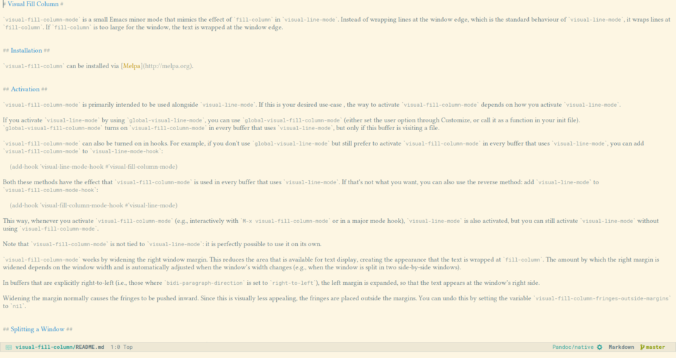
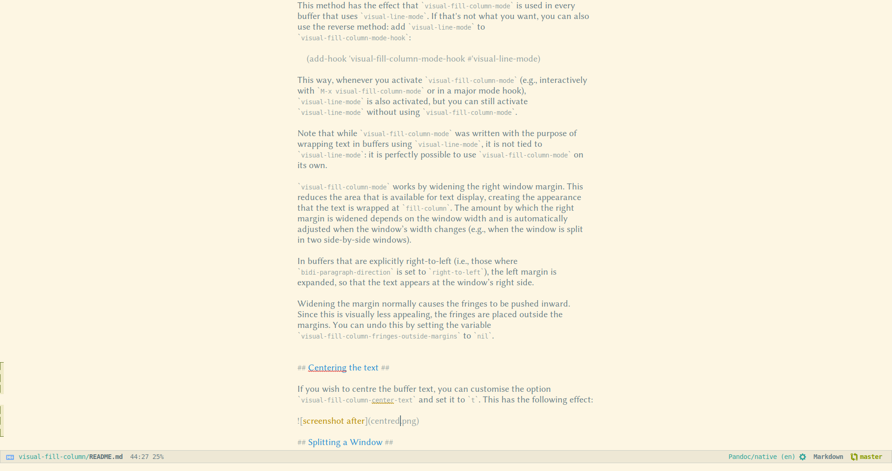

# Visual Fill Column #

`visual-fill-column-mode` is a small Emacs minor mode that mimics the effect of `fill-column` in `visual-line-mode`. Instead of wrapping lines at the window edge, which is the standard behaviour of `visual-line-mode`, it wraps lines at `fill-column` (or `visual-fill-column-width`, if set).  That is, it turns the view on the left into the view on the right, without changing the contents of the file:

 Without `visual-fill-column`     | With `visual-fill-column`
--------------------------------- | -------------------------------
  | 

## Installation ##

`visual-fill-column` can be installed from [Melpa](https://melpa.org/).

## Usage ##

The primary purpose of `visual-fill-column-mode` is to wrap text at `fill-column` in buffers that use `visual-line-mode`. The most straightforward way to achieve this is to add it to `visual-line-mode-hook`:

    (add-hook 'visual-line-mode-hook #'visual-fill-column-mode)

There is also a globalised mode `global-visual-fill-column-mode`. This mode turns on `visual-fill-column-mode` in every buffer that visits a file. Activate it either through Customize or by calling it as a function in your init file. In buffers that do not visit a file, `visual-fill-column-mode` may be disruptive, so `global-visual-fill-column-mode` is restricted to file-visiting buffers. (You can, of course still activate `visual-fill-column-mode` manually or in hooks for such buffers, though.)

## Wrap prefix ##

In `auto-fill-mode`, there is an option `adaptive-fill-mode`, which ensures that if the first line of a paragraph is indented or has, e.g., a mail quote prefix (`> `), this is applied to the entire paragraph. To get the same effect, you can use the package [`adaptive-wrap`](https://elpa.gnu.org/packages/adaptive-wrap.html), which is available from GNU Elpa. Like `visual-fill-column-mode`, its effect is purely visual, the buffer text is not actually modified. The effect of this package is shown in the following two images:

 Without `adaptive-wrap`     | With `adaptive-wrap`
--------------------------------- | -------------------------------
  | 

## Centering the text ##

Another use case for `visual-fill-column` is to centre the text in a window:

This effect is achieved by setting the user option `visual-fill-column-center-text`. Note that `visual-fill-column-mode` is not dependent on `visual-line-mode`, so it can be used to centre text in buffers that use `auto-fill-mode` or in programming modes.

Note that `visual-fill-column-center-text` automatically becomes buffer-local when it is set. Therefore, if you wish to make this the default, either use the Customize interface or use `setq-default` in your init file, rather than `setq`:

    (setq-default visual-fill-column-center-text t)

Note: If you are interested in a fully distraction-free writing environment, that not only centres the text but also removes the window decorations, the mode line etc., take a look at [`writeroom-mode`](https://github.com/joostkremers/writeroom-mode).

## How it works ##

`visual-fill-column-mode` works by widening the window margins. This reduces the area that is available for text display, creating the appearance that the text is wrapped at `fill-column`. In the default configuration, the only right margin is widened, mimicking the effect of `auto-fill-mode`. In buffers that are explicitly right-to-left (i.e., those where `bidi-paragraph-direction` is set to `right-to-left`), the left margin is expanded, so that the text appears at the window’s right side. When `visual-fill-column-center-text` is set, both margins are widened.

The amount by which the margins are widened depends on the window width and is automatically adjusted when the window’s width changes (e.g., when the window is split in two side-by-side windows).

## Splitting a Window ##

Emacs won’t vertically split a window (i.e., into two side-by-side windows) that has wide margins. As a result, displaying buffers such as `*Help*` buffers, `*Completion*` buffers, etc., won’t split a window vertically, even if there appears to be enough space for a vertical split. This is technically not problematic, but it may be undesirable from a user's point of view. To remedy this, you can set the option `visual-fill-column-enable-sensible-window-split`. When this option is set, the variable `split-window-preferred-function` is set to the function `visual-fill-column-split-window-sensibly`, which first removes the margins and then calls `split-window-sensibly` to do the actual splitting.

This option does not affect the ability to split windows manually. Even if you keep `visual-fill-column-enable-sensible-window-split` unset, you can still split a window into two side-by-side windows by invoking e.g., `split-window-right` (`C-x 3`).

Note that this option replaces the option `visual-fill-column-inhibit-sensible-window-split`. This option was unset by default, causing `split-window-preferred-function` to be set, which had the unfortunate side effect that it would overwrite a user-defined setting for that variable without warning.

To get the old behaviour back, simply customise the option `visual-fill-column-enable-sensible-window-split` or set it to `t` in your init file.

## Adjusting Text Size ##

The width of the margins is adjusted for the text size: larger text size means smaller margins. However, interactive adjustments to the text size (e.g., with `text-size-adjust`) cannot be detected by `visual-fill-column-mode`, therefore if you adjust the text size while `visual-fill-column-mode` is active, the margins won't be adjusted. To remedy this, you can force a redisplay, e.g., by switching buffers, by splitting and unsplitting the window or by calling `redraw-display`.

Alternatively, you can advise the function `text-size-adjust` with the function `visual-fill-column-adjust`:

    (advice-add 'text-scale-adjust :after #'visual-fill-column-adjust)

Note that this functionality is controlled by the option `visual-fill-column-adjust-for-text-scale`. If this is set to `nil`, the margins are not adjusted for the text size.

## Customisation ##

The customisation group `visual-fill-column` has several options that can be used to customise the package.

`visual-fill-column-width`: column at which to wrap lines. If set to `nil` (the default), use the value of `fill-column` instead.

`visual-fill-column-center-text`: if set to `t`, centre the text area in the window. By default, the text is displayed at the window’s (left) edge, mimicking the effect of `fill-column`.

`visual-fill-column-extra-text-width`: extra columns added to the left and right side of the text area. This should be a cons cell of two integers `(<left> . <right>)`. If `visual-fill-column-center-text` is `t`, the text area is centred before the extra columns are added. This is currently used by `writeroom-mode` to add room for line numbers without shifting the text off-centre.

`visual-fill-column-fringes-outside-margins`: if set to `t`, put the fringes outside the margins. Widening the margin would normally cause the fringes to be pushed inward, because by default, they appear between the margins and the text. This effect may be visually less appealing, therefore, `visual-fill-column-mode` places the fringes outside the margins. If you prefer to have the fringes inside the margins, unset this option.

These options are buffer-local, so the values you set in your init file are default values. They can also be set in mode hooks or directory or file local variables in order to customise particular files or file types.

The following options apply to all buffers with `visual-fill-column-mode` enabled:

`visual-fill-column-inhibit-sensible-window-split` can be set to keep `visual-fill-column-mode` from setting `split-window-preferred-function`, as discussed above.

`visual-fill-column-adjust-for-text-scale` determines whether text scaling is taken into account when computing the width of the margins.

`visual-fill-column-mode` also binds several mouse events for the left and right margins, so that scrolling or clicking on the margins does what you'd expect (rather than cause an "event not bound" error). If you wish to adjust these bindings, you should do so in `visual-fill-column-mode-map`.
